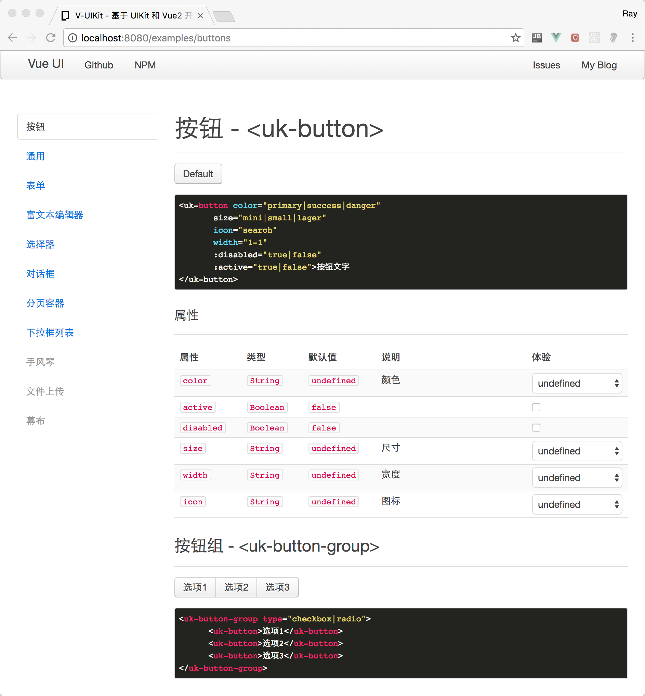

# V-UIKit

这是一套适合中文世界使用的基于 UIKit 和 Vue2 开发的界面套件。

## 安装

```
$ npm i v-uikit -D
```

## 注册 V-UIKit

```js
import Vue from 'vue'
import VueUIKit from 'v-uikit'
import 'v-uikit/dist/v-uikit.css'

Vue.use(VueUIKit)
```

## 组件

- `<uk-icon>`——图标
- `<uk-badge>`——
- `<uk-button>`——按钮
- `<uk-button-group>`——按钮组
- `<uk-accordion>` , `<uk-section>` - 手风琴分页容器
- `<uk-tabs>`,`<uk-tab>`——分页容器
- `<uk-nav>`——导航器
- `<uk-datepicker>`——日期选择器
- `<uk-timepicker>`——时间选择器
- `<uk-list>`——数据列表
- `<uk-dropdown-list>`——下拉数据列表
- `<uk-html-editor>`——富文本编辑器
- `<uk-alert>`——提示框
- `<uk-modal>`——对话框
- `<uk-pager>`——分页器
- `<uk-password>`——密码输入
- `<uk-select>`——选择输入
- `<uk-form>`——表单
- `<uk-itempicker>`——数据列表选择器
- `<uk-field>` - 输入字段容器
- `<uk-icon-field>`——带图标的输入字段容器
- `<uk-thumbnail>`——缩略图
- `<uk-overlay>`——带文字覆盖层的缩略图
- `<uk-uploader`——多文件上传区域

## 在线示例

[示例](https://dotnetage.github.io/vue-ui/)


